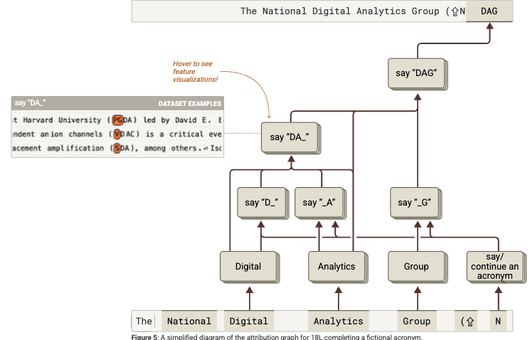
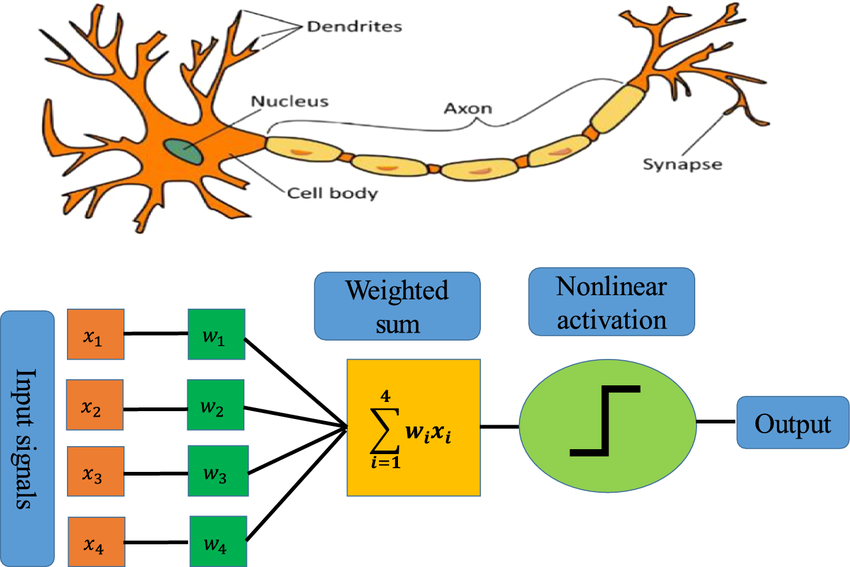
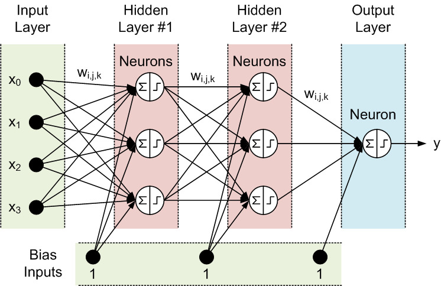
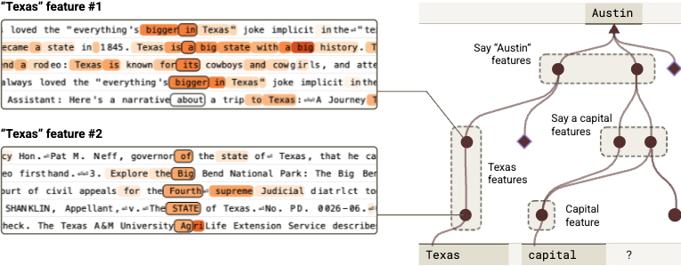
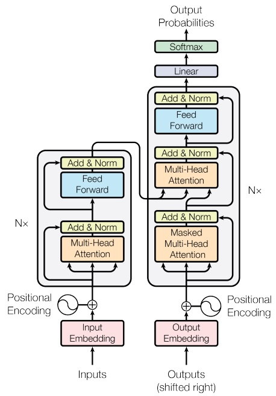
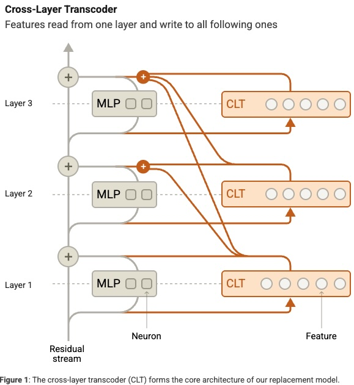
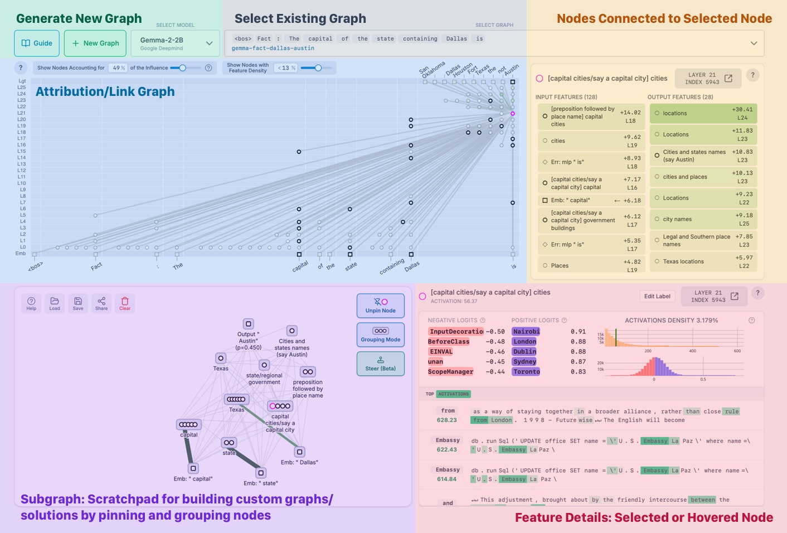

= AI/ML Model Interpretability
:revealjs_theme: moon
:revealjs_transition: slide
:source-highlighter: highlight.js
:icons: font
:pdf-page-layout: landscape
:autofit-option:
:optimize: screen
:pagenums:
:pdf-page-mode: fullscreen

== Understanding AI Model Internals

[.stretch]
--
* Goal: Make AI models transparent and interpretable through systematic analysis

* Challenge: Understanding AI models is similar to biological research - complex systems requiring sophisticated tools

* Predictions about unexpected AI outputs
* "Microscopes" for AI model internals

_Lindsey, et al., "On the Biology of a Large Language Model", Transformer Circuits, 2025._
--

== One slide overview (MLP=ANN=FF)

[.stretch]
--

--

_Ameisen, et al., "Circuit Tracing: Revealing Computational Graphs in Language Models", Transformer Circuits, 2025._

== Transformer Architecture of LLMs

[.stretch]
--
* Attention layer followed by *FF Layer*

* Attention Heads: long-range connections within text
* Feed Forward: same as in previous slide 
* N x times : multiple heads run in parallel
* If you trained a neural network, similar plus attention

_Vaswani A et al. Attention is all you need. arXiv:1706.03762. 2017;30_

--

== The Landscape of Interpretability

[.stretch]
--
* Neurons are "Poly-semantic" (superposition phenomenon) 
* Sparse Autoencoders: Identifying knowledge (features) stored in the neurons

* Linear Probes: Internal linear representations of specific concepts
* Intervention Experiments: Steering, neural activation patching, and ablations

https://transformer-circuits.pub/
--

== Attribution Graphs

[.stretch]
--
* Interactions between features (text from input) activating neurons
* Graphs showing feature-feature interactions on specific prompts

* Interaction chains influencing model output
* Prompt analysis revealing circuits

https://www.neuronpedia.org/
--

== Thanks !
[.stretch]
--
* https://github.com/KKrampis/presentations
* Transformers the tech behind LLMs https://tinyurl.com/3b1b-Transformers
* https://tinyurl.com/alignment-nanda-papers
* https://tinyurl.com/nanda-become-interp-researcher  
* https://www.neelnanda.io/mechanistic-interpretability/quickstart
--
